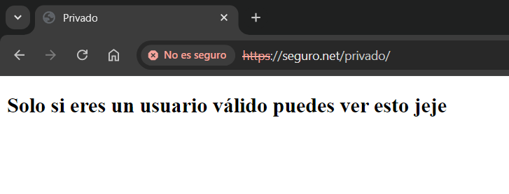

# Como configurar tu servidor Nginx

## Estructura de archivos

1. **Carpeta conf**  
   - Creamos una carpeta conf, donde copiamos el archivo `nginx.conf` que es la configuración de nginx por defecto

   

2. **Carpeta sites-available**  
   - Creamos una carpeta sites-available y creamos los archivos de configuración de nuestros dominios que usaremos en el futuro

   

   - Esto en un ejemplo de configuración que voy a utilizar para mi primer dominio usando samuel.conf
   

2. **Carpeta website**
    - Creamos una carpeta website, que será el directorio que alojará los dominios para cada dominio
    

    - Dentro de cada respectivo dominio crearemos nuestros respectivos html básico (index) y con sus respectivos errores que a su vez son html
    -Ejemplo del dominio samuel.com con su index.html y su error_404.html
    
    
    

3. **Privado**
    - Para el dominio privado con SSL, crearemos una carpeta 'privado' donde alojaremos los anteriormente mencionados html y errores para dicho dominio
    

4. **Scripts**
    - Crearemos una carpeta scripts que a su vez tendrá dentro un fichero.sh (en mi caso entrypoint.sh) que se encargará de ejecutar los comandos para habilitar los sitios, activar el módulo SSL y reiniciar el servicio de Nginx. 
    

     
    

5. **Certificados y contraseñas**
    - Crearemos las carpetas de certificados(certs) y contraseñas(htppasswd) para posteriormente añadir los archivos de autentificacion, la clave pública y la privada
    

6. **Docker-compose**
    - Crearemos un fichero llamado docker-compose.yml en el cual se establece la configuración necesaria para ejecutar nuestro contenedor Apache
    
    

7. **Generación de los certificados SSL**
    - Para la generación de los certificados previamente mencionados, deberemos tener instalado OpenSSL y ejecutaremos el siguiente comando
    `openssl req -x509 -nodes -days 365 -newkey rsa:2048 -keyout seguro.key -out seguro.crt`
    (En mi caso es seguro)
    - Una vez hecho el comando deberás introducir una serie de atributos como pais,provincia,pais...
    - Si todo es correcto generará los certificados automáticamente (introducirlos en el directorio certs)
    

8. **Host**
    - Modificaremos el fichero host ubicado en `C:\Windows\System32\drivers\etc\host` y añadiremos las IP de los dominios a usar
    

9. **Despliegue del contenedor**
    - Para levantar el contenedor utilizaremos el comando: `docker-compose up -d`
    - Si no se ha generado bien siempre lo podemos tirar abajo con `docker-compose down`

10. **Generación del .htpsswd**
    - Ahora crearemos el fichero .htpasswd dentro del directorio htpsswd que hemos creado anteriormente
    - Abriremos nuestro navegador de confianza y pondremos la siguiente URL `https://bcrypt-generator.com/` que nos dirijirá a Bcrypt, una página donde nos encriptará nuestra contraseña
    - En el fichero creado pondremos nuestro usuario:lacontraseñaencriptada
    

**Ejemplo de los dominios**
     
    
    - Dominio `samuel.com`
    
    - Dominio `www.cortes.com`
    
    - Dominio `seguro.net`
    
    - Dominio `seguro.net/privado`
    
    

    

